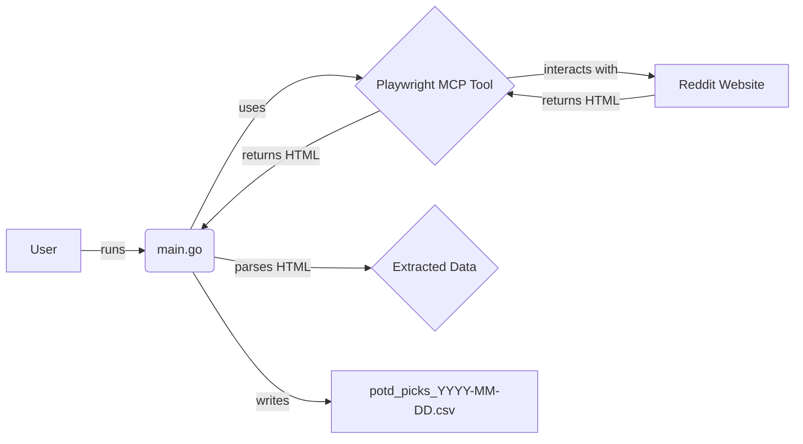

# System Patterns: Degen's Digest

**Overall Architecture:**
-   A single Go application (`main.go`) orchestrates the process.
-   Interaction with the target website (Reddit) is delegated to the Playwright MCP server via its tools.
-   The Go application receives HTML content from Playwright and performs the parsing and data structuring.
-   Output is written directly to a CSV file in the project root.

**Key Technical Decisions:**
-   **Go for Core Logic:** Chosen for its standard library capabilities (HTTP, regex, CSV, file I/O) and potential for performance, although parsing complex/irregular HTML with regex can be challenging.
-   **Playwright MCP Tool for Browser Automation:** Leverages an existing tool to handle the complexities of browser interaction, JavaScript execution (if needed for dynamic content loading on Reddit), and fetching rendered HTML. This avoids needing browser automation libraries directly within the Go code.
-   **Regex for Parsing:** Standard Go `regexp` package will be used for extracting data from HTML. This is chosen for simplicity within Go's standard library but comes with inherent fragility. If Reddit's HTML structure changes significantly, the regex patterns will likely need updating. More robust HTML parsing libraries (like goquery) are avoided for now to stick closer to standard library dependencies unless parsing proves too difficult with regex alone.
-   **Dated CSV Output:** Files are named `potd_picks_YYYY-MM-DD.csv` to keep a historical record of daily picks.

**Component Relationships:**

**Potential Fragility Points:**
-   **Reddit HTML Structure:** Changes to Reddit's CSS classes, element IDs, or general layout can break the scraping logic (both thread finding and comment parsing).
-   **Comment Formatting:** High variability in how users format their picks makes robust regex parsing difficult. The script may miss data or extract it incorrectly for non-standard formats.
-   **POTD Thread Title Format:** Relies on a predictable pattern for the daily POTD thread title. Changes to this pattern will break thread identification.
-   **Rate Limiting/Blocking:** Excessive requests could trigger Reddit's anti-scraping measures. Playwright usage helps mitigate this but doesn't eliminate the risk.
