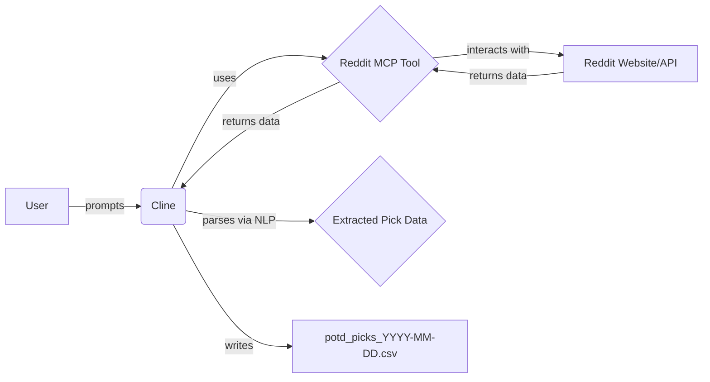

# System Patterns: Degen's Digest

**Overall Architecture:**
-   The process is orchestrated by Cline using MCP tools.
-   The Reddit MCP server is used to fetch thread titles and comment content directly.
-   Cline's Natural Language Processing (NLP) capabilities are used to parse the fetched comment text, identify valid POTD picks, and extract structured data.
-   Output (structured pick data) is written directly to a CSV file in the project root.

**Key Technical Decisions:**
-   **Reddit MCP Server:** Used for direct interaction with Reddit data (fetching hot threads and post content), avoiding the need for manual scraping or browser automation for this step.
-   **Cline NLP for Parsing:** Leverages advanced NLP to understand and extract information from inconsistently formatted user comments, replacing the previous fragile regex/script-based parsing.
-   **Top-Level Comment Filtering:** The process focuses on top-level comments (depth=0 or equivalent filtering via MCP tool/NLP) to target actual POTD submissions rather than replies.
-   **Dated CSV Output:** Files are named `potd_picks_YYYY-MM-DD.csv` to keep a historical record of daily picks.

**Component Relationships:**

**Potential Fragility Points:**
-   **Reddit MCP Tool Reliability:** Dependence on the Reddit MCP server functioning correctly and handling Reddit's structure/API appropriately.
-   **Comment Formatting:** While NLP is more robust than regex, extremely unusual or ambiguous comment formats might still pose challenges for accurate data extraction.
-   **POTD Thread Title Format:** Still relies on a predictable pattern for the daily POTD thread title for identification via the `fetch_reddit_hot_threads` tool.
-   **Reddit Rate Limiting:** The Reddit MCP server might be subject to Reddit's API rate limits.
